San Jose State University

Course: Enterprise Software - CMPE 172/Spring 2020

Team Members: Maneek Dhillon, Gaston Garrido, Udaypal Singh

Project Introduction:  
NoteApp lets users to create an account and log in using email and password. The application allows users to create a note which will be available and can be viewed by everyone. A note has a topic, title, content, username, and created at fields. Although every user can see the note, only the user who created it will have the authority to edit or delete it. Our application will let users subscribe to a topic which will be very convenient to manage topics which users are interested in. If at some point user wants to unsubscribe to topic, there is also unsubscribe option for that functionality. Overall, our application will create a platform to share notes with different topics which will be easily be accessible from our home page.

Sample Demo Screenshots:  
At the start of the application, a user can log in if an account exist.
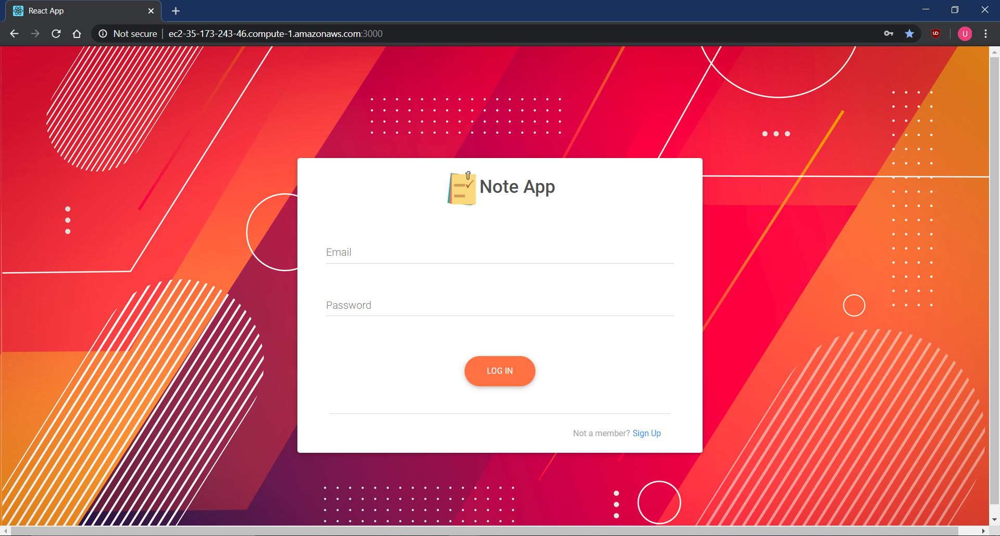

If a user does not have an account, he or she can easily create it by clicking on the Sign-Up link in the bottom right corner.
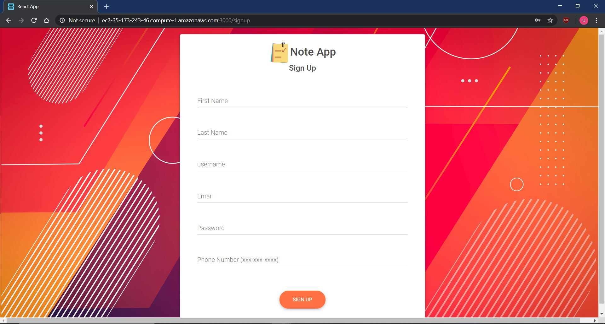

After creating an account, a user can log in, and the user will be redirected to the home page where all the notes will be available.
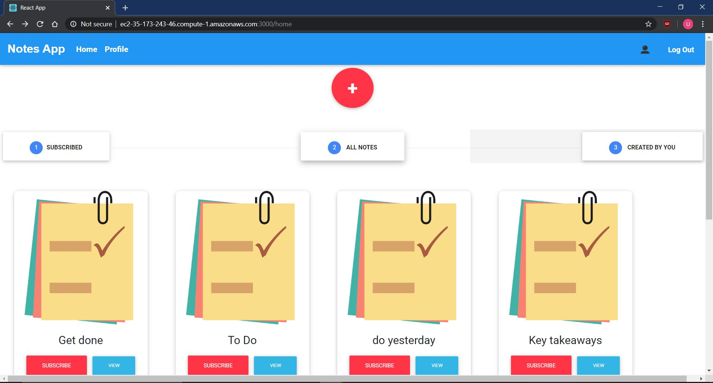

A user may add a note by clicking on the plus button at the top of the home page. After clicking on the add button, a user will be redirected to add page where details about the new note can be filled out.
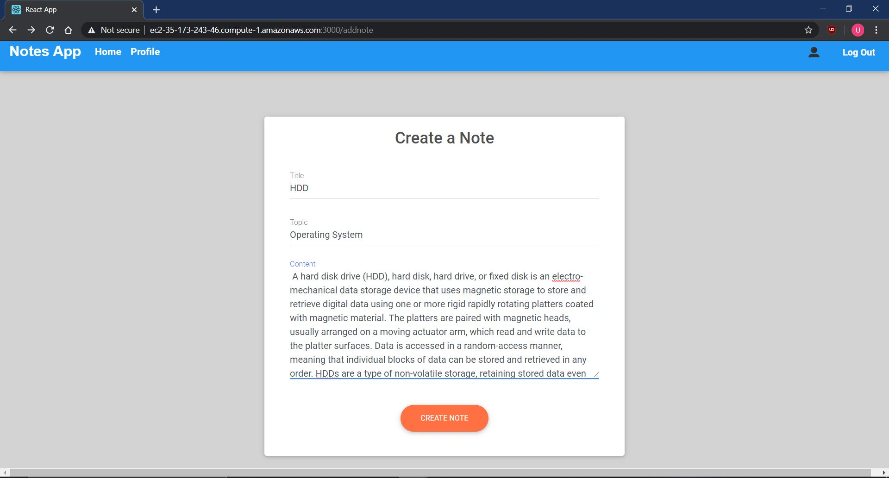

After clicking on "Create Note" button, user will be redirected back to home page. From home page a user may want to view a note in more detail. This can be achieved by clicking on the "View Button" on the card, and user will be redirected to a page with more detail about a note. To go back to home, user can click on the back button on the bottom of the detailed note card.
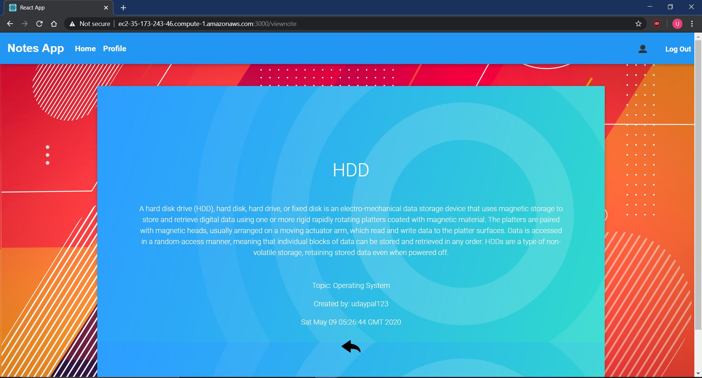

A user can check out the notes which a user is interested in and subscribe to a topic. If a user subscribes to a topic, the notes associated with the topic will be listed under the subscribed notes. All subscribed notes can be accessed by clicking on subscribed tag.
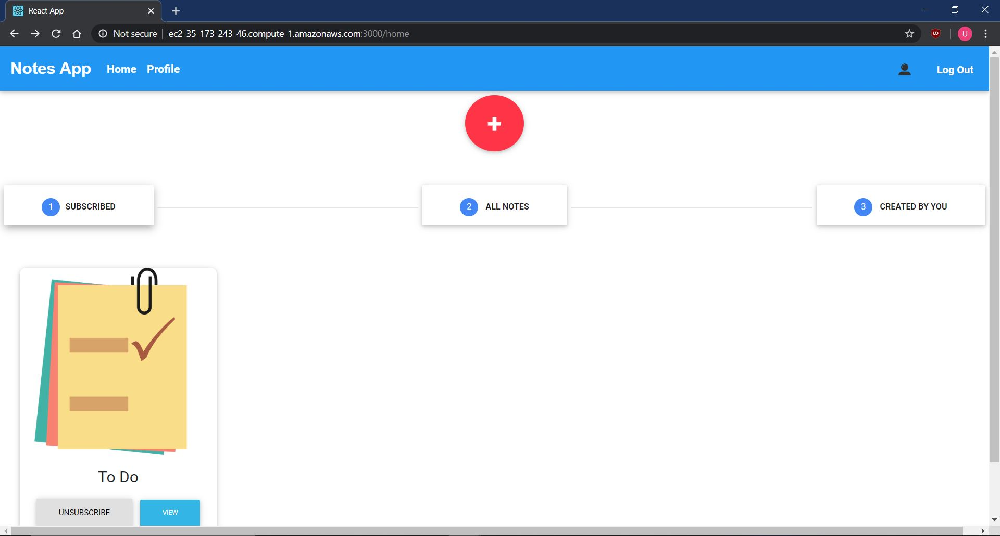

Notes created by the user can be accessed by clicking on "Created by You".
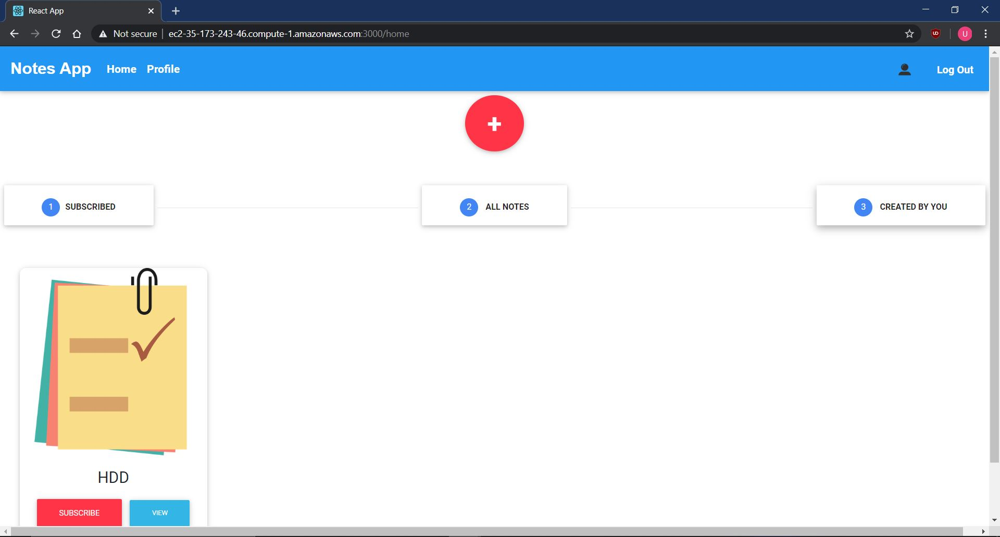

Profile can be accessed by clicking on the profile link from the navigation bar placed at the top of the page. Profile gives you access to edit or delete a note you have created.
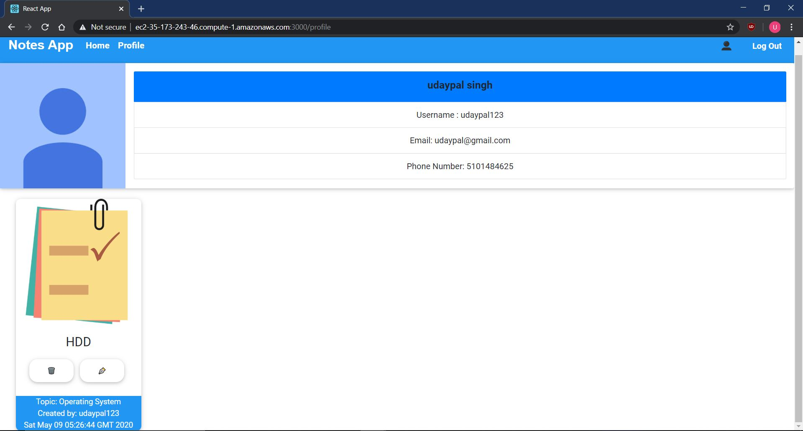

Pre-requisites for setup:  
For running locally:
1. A running computer with a functional operating system
2. Internet Access
3. Spring boot should be installed (IntelliJ can also be used for Spring boot) 
4. Maven should be installed 
5. Node.js should be installed
6. An editor (Visual Studios Code is preferred)
7. A browser with JavaScript enabled

For running with global URL:
1. A browser with JavaScript enabled
2. Internet Access

Instructions on how to run the project locally:  
Need to open two separate terminal windows. One to run the frontend and one to run the backend

Run without docker:
1. Open terminal and go into SpringBoot_Backend directory 
2. Run "mvn clean install"
3. Now you can run the backend by entering the command "mvn spring-boot:run"
4. Open another terminal and go into React_Frontend directory
5. Run "npm install"
6. Run "npm start"

Run with Docker:
1. Make sure you have docker installed and it is running. 
2. Open terminal and go into SpringBoot_Backend directory 
3. Run "mvn clean install"
4. Run "sudo docker build -t noteapp:1.0 ."
5. Run "sudo docker run -p 8080:8080 -t noteapp:1.0"
6. Open another terminal and go into React_Frontend directory
7. Run "npm install"
8. Run "npm start"

Useful Docker commands:
1. List all containers: "sudo docker ps"
2. Stop a container by container id: "sudo docker stop 3e36a2c0c241"
3. tag image: "sudo docker image tag noteapp:1.0 your_id/noteapp:1.0"
4. Push Image to docker hub: run tag image command then run "sudo docker image push your_id/noteapp:1.0"

UML Diagrams:  
UML Class Diagram
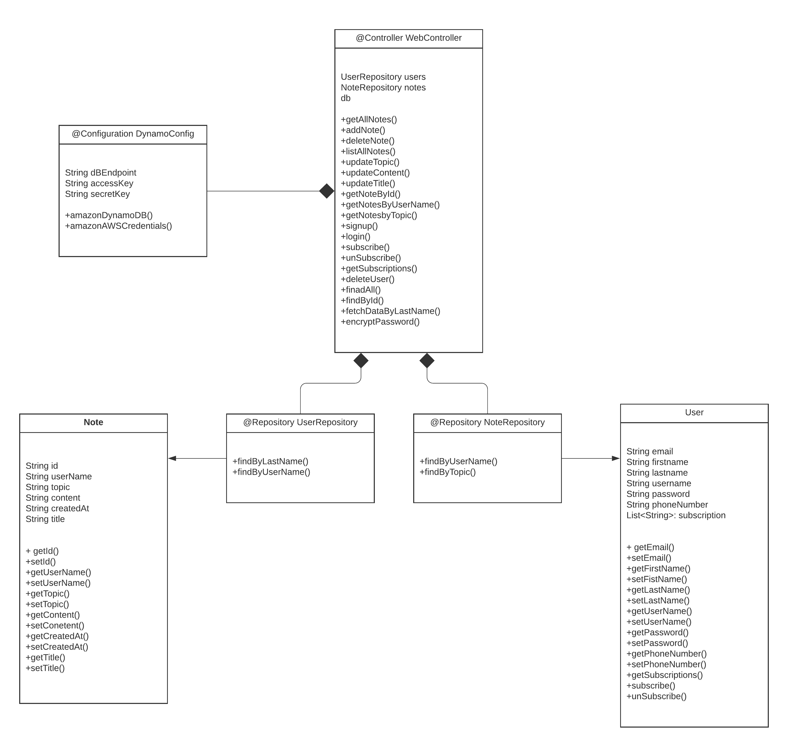

Sequence Diagram
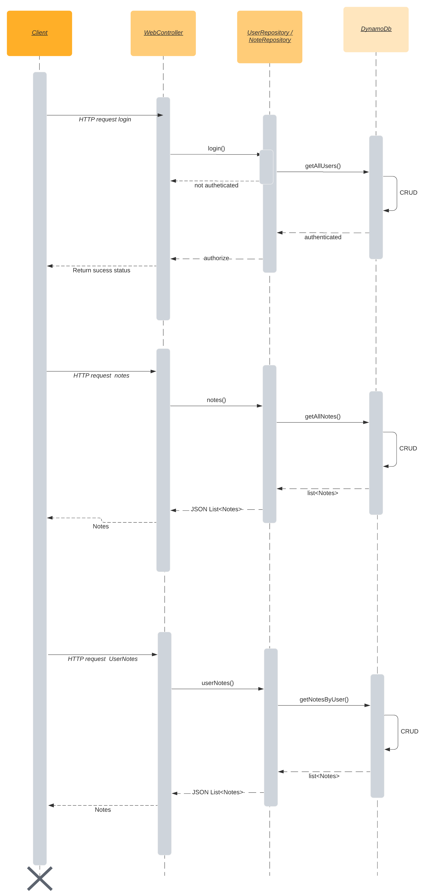

Schema:  
User Table Schema
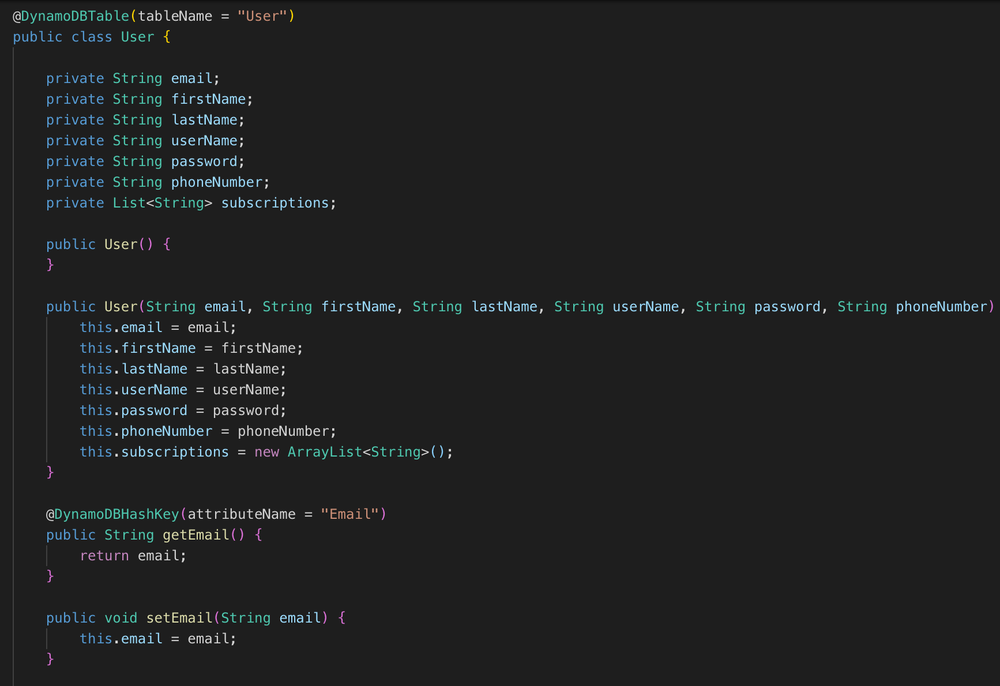

Note Table Schema
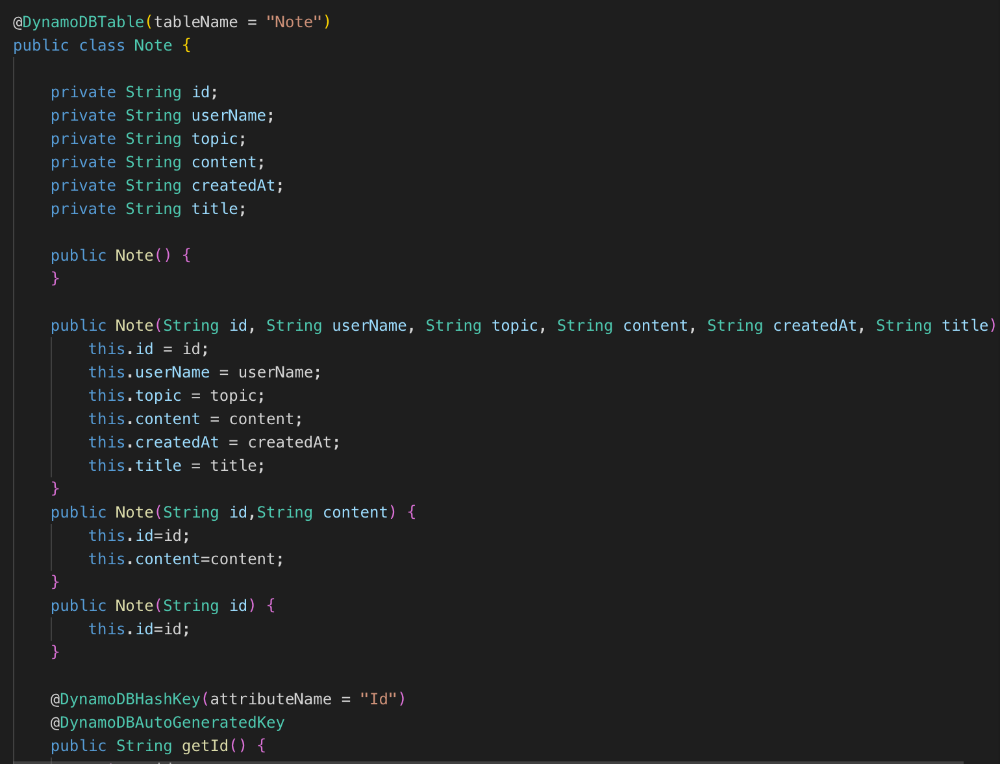

Database Queries:  
You do not use actual queries for DynamoDB. You use functions that are already supported by DynamoDB. We used methods that were provided by Spring's CRUD Repository interface.  
These methods include:  
findAll();  
save();  
delete();  
findOne();  

Mid tier APIs:

UI data transport:  
Data is transferred with Json objects

